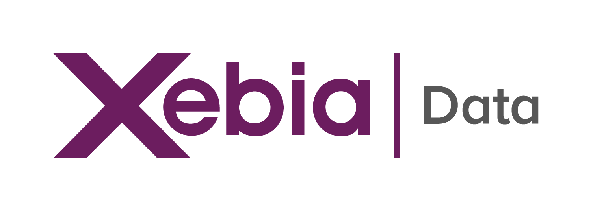
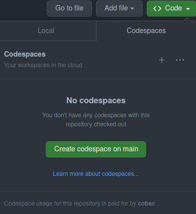
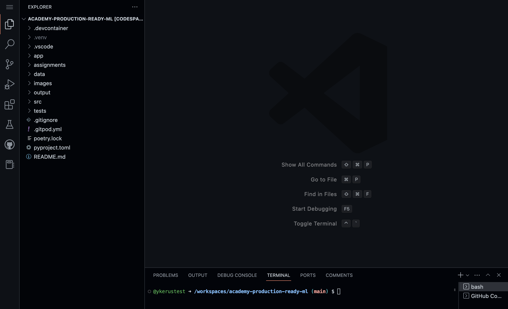
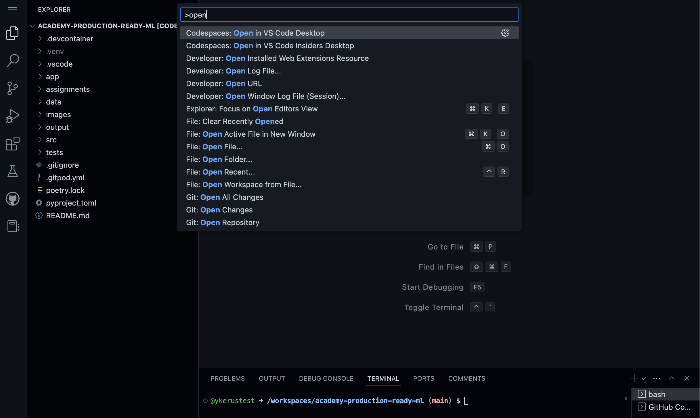
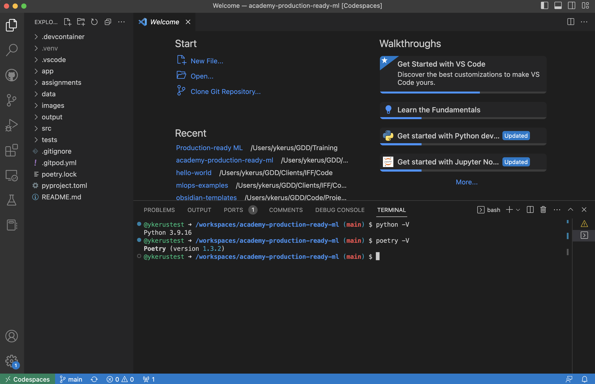
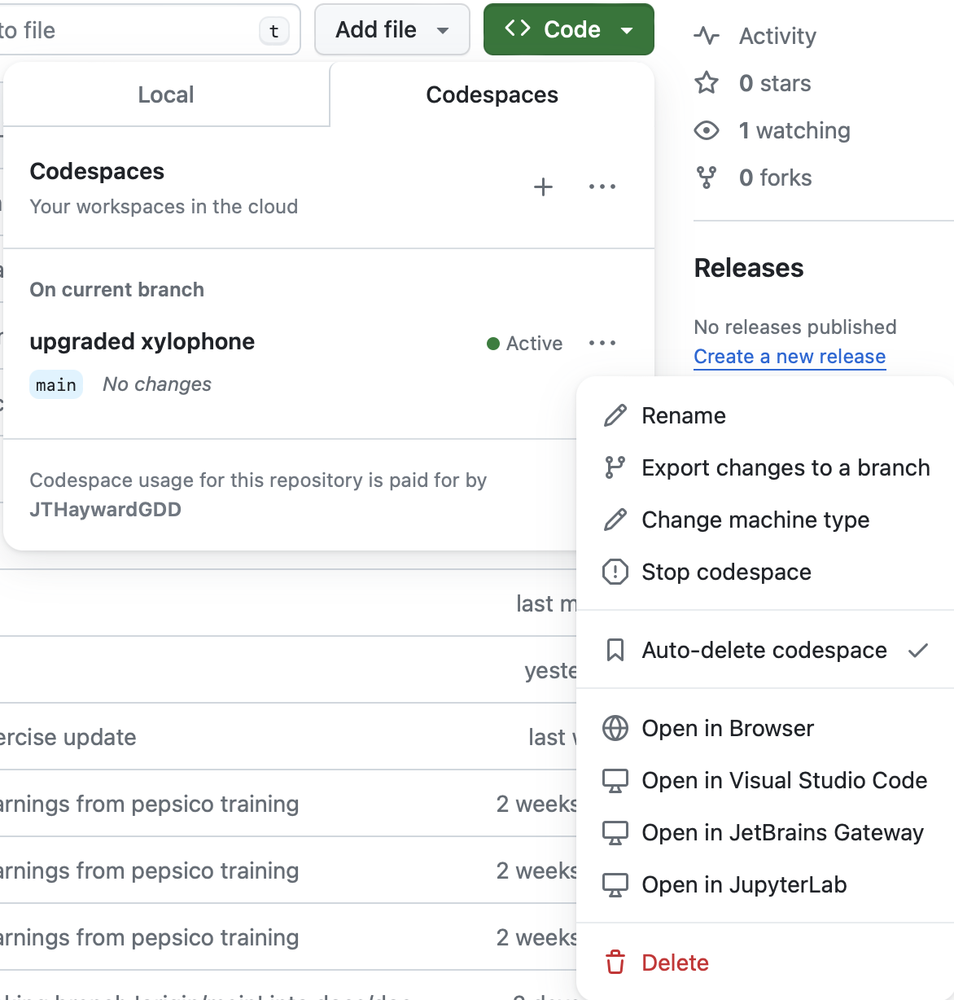

# LLM applications

Hi! 👋🏻 

This repository contains the exercises and material we will cover during the "LLM applications" training.

Since you're reading this, it means you've successfully gained access to this repo 🎉.

Please run through the **set-up** instructions _before_ the start of the training. If you encounter problems, please let your trainer know so that they can be dealt with before your first session.

## Set-up

If you have a local Python installation, and you can set up Jupyter and Poetry, you will be able to follow the training using your own setup and the editor of your choice.

Alternatively, we provide a devcontainer that spins up an environment that you can use within VS Code with everything ready for the training. The steps to set this up are:

1. ✅ Access the repository
2. Open or create a codespace on the `main` branch:

3. [Codespaces](https://docs.github.com/en/codespaces/overview) allow you to work on a repository on a computer other than your own, saving you from the trouble of setting everything up yourself. After creating your codespace succesfully, you should see a VS Code interface in your browser:

4. (Optional) Access the codespace in your locally installed VS Code Desktop. To do so, open the command palette in VS Code you have opened in your browser. To open the command palette, on Mac the shortcut is `⌘+SHIFT+P`, on Windows and Linux it is `Ctrl+Shift+P`. From the command palette, select "Codespaces: Open in VS Code Desktop", and follow the steps to open VS Code locally.

5. You should now have access to the code, in your personal codespace, in your locally installed VS Code Desktop.

To make sure everything is setup correctly you can:
   - Inspect the bottom left corner, which should say "Codespaces" (may be located elsewhere in the Windows version)
   - Open a terminal in VS Code and run `python -V`, which should return a Python version >= 3.9.
   - Run `poetry -V`, which should return any version of Poetry.

6. To install the project, in the VS Code terminal run `poetry install`.

7. That's it! You should be all setup now.<!-- You can close VS Code and the tabs you have opened in your browser. -->
You can delete the codespace to save your account Usage/Storage hours and start a new one during the training. -->

## Slides
The slides for this course can be distributed as PDF.

## Exercises
Each part of the training consists of a set of exercises.
The exercises are located in the `exercises` folder and the solutions are located in the `solutions` folder.
Each part starts with notebook-based exercises, followed by a more complex application.
The notebook-based exercises are meant to get you familiar with the concepts, while the application exercises are meant to test knowledge get you ready for larger projects.

## Applications

You will use [streamlit](https://streamlit.io/) to build the apps in the assignments. In case you are unfamiliar with this framework we have provided a [Streamlit tutorial](./streamlit).

Please check the documentation on [port forwarding](https://docs.github.com/en/codespaces/developing-in-a-codespace/forwarding-ports-in-your-codespace#) if you have trouble opening your streamlit application in a Codespace.

## Hackathon
This is an open-ended exercise where you can apply the concepts you've learned in the training.
You find the instructions in the [exercises/42_hackathon/readme.md](./exercises/42_hackathon/README.md).

## Miro

[Miro board](https://miro.com/app/board/uXjVLYCaxj8=/?share_link_id=765687895125)

Password: Building-LLM-Applications

## About

Xebia Data (c) 2023.

