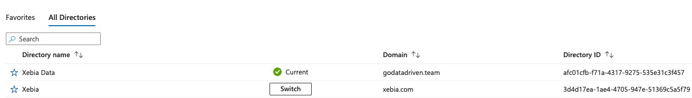

# How to switch to the training subscription
We use a separate subscription for the training to prevent accidental data leaks to participants.
This subscription is called `Xebia Data` and is different from the default `Xebia` subscription.

You can do this as follows:
1. Click on your profile in the top right corner
2. Click on `Switch directory`
3. Click on the `Switch` button behind the directory with the name `Xebia Data`.

<mark>If you don't see the option for `Xebia Data` contact ict@xebia.com and CC Giovanni.</mark>
