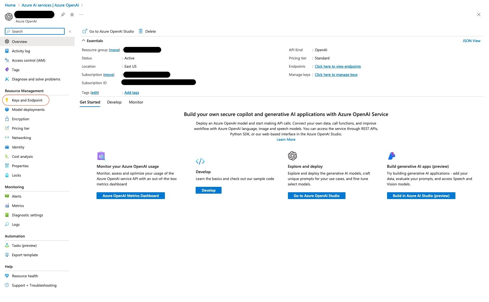

# How to reset OpenAI API keys
Some participants may try to user the API keys after the training.
To prevent abuse, it is best to reset the API keys after each training day.
You can do this as follows:

1. Go to portal.azure.com
2. Go find your Azure OpenAI services resource.
   1. Click on the search bar and search for `OpenAI`.
   2. Click on the `Azure OpenAI` service.
   3. Click on resource you created previously.
3. On the resource page, click on the `Keys and Endpoint` tab under `Resource Management`.
   
4. Click on the `Regenerate Key 1` or `Regenerate Key 2` button.
5. A few hours before the next training starts, copy the new key to the GitHub CodeSpace secrets.

Note: Azure provides you with two API keys. Both keys are valid and can be used to make API calls.
So it is a good idea to consistently expose only one of the keys to the participants.
This way, you can keep the other key for yourself, and you don't have to worry about resetting your personal key.