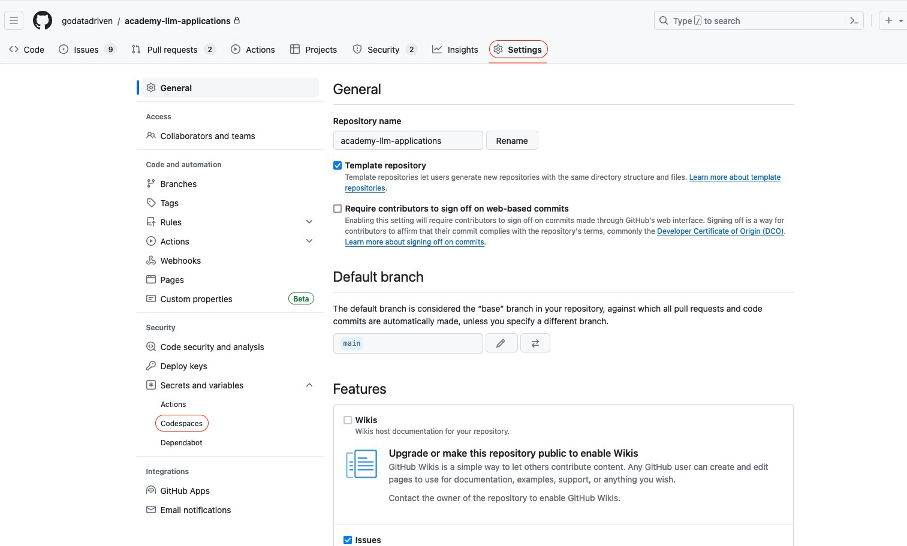
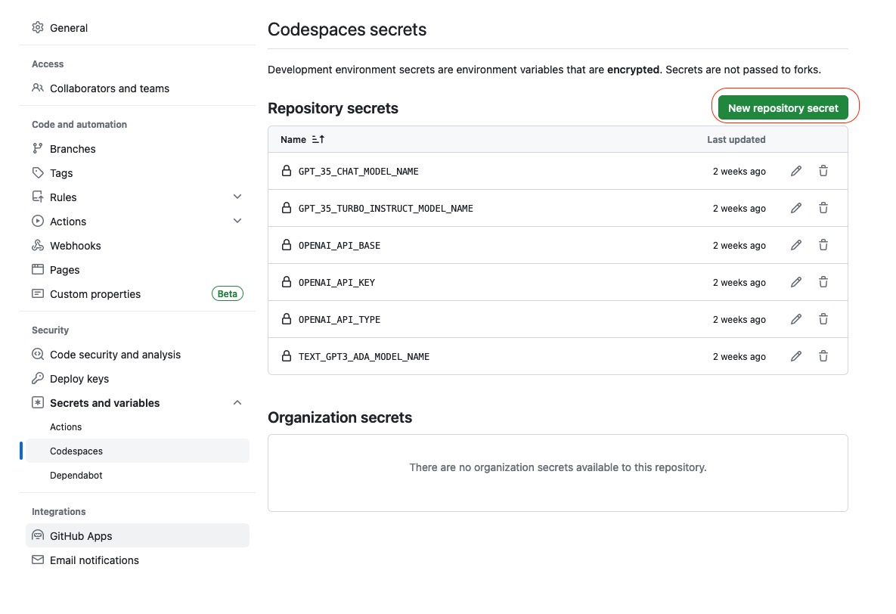

# How to set GitHub CodeSpace secrets

1. Goto the GitHub repo you created for the training.
2. Click on the `Settings` tab. You must be an admin of the repo to see this tab. If you created the repo, you should be an admin else ask for help in the `xd-admins-help` Slack channel.
3. Go to the `Codespaces secrets` subpage by click on the `Security > Secerts and variables > Codespaces`.
   
4. Click on the `New codespace secret` button to add your secret.
   

Note: only people with write access to the repo can access the secrets in the GitHub CodeSpaces.
So make sure you the participants have the correct role in the repo.
